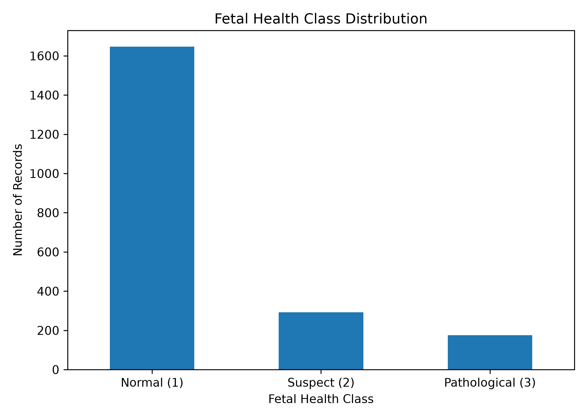
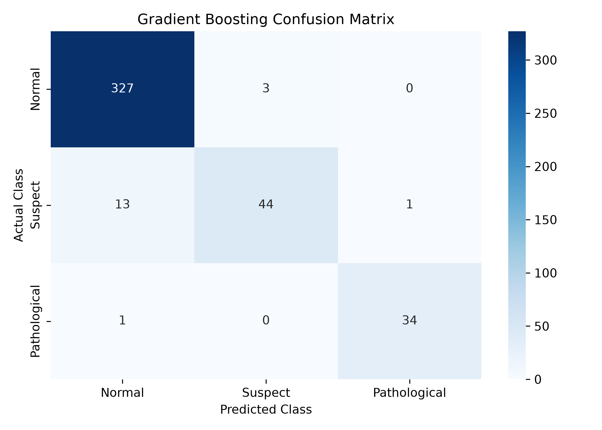
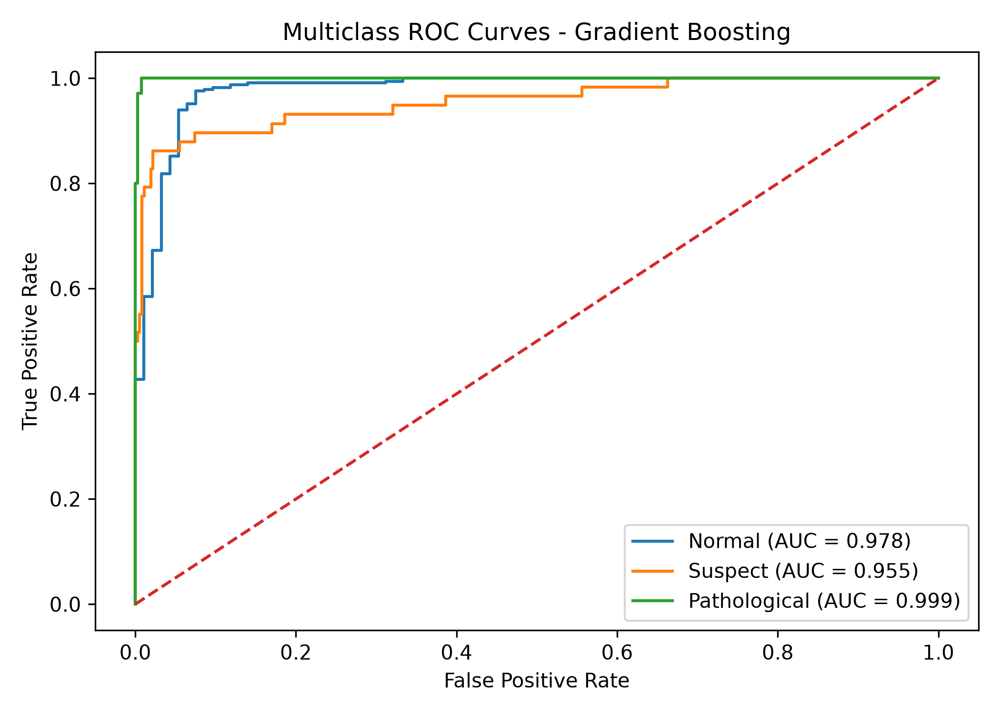

# Multiclass Classification of Fetal Health using Cardiotocogram Data

## An End-to-End Machine Learning System for Fetal Health Classification from CTG Data

An academic machine learning project that classifies Cardiotocography (CTG) records into **Normal, Suspect, and Pathological** fetal health categories using supervised multiclass classification.

---

## Team Members

| Name | SRN |
|:---|:---|
| **Kirthana S** | **PES1UG24AM136** |
| **Keerthishree R** | **PES1UG24AM132** |

---

## Project Overview

Cardiotocography (CTG) is a technique used to record fetal heart rate and uterine activity. CTG recordings contain multiple numerical characteristics that can provide information about fetal condition.

This project develops an **end-to-end machine learning classification system** that processes CTG measurements and predicts one of three fetal health categories:

- **Normal**
- **Suspect**
- **Pathological**

The complete workflow includes:

- Data preprocessing
- Exploratory data analysis
- Feature scaling
- Model training
- Model comparison
- Model evaluation
- Hyperparameter tuning
- Model persistence
- Streamlit deployment

---

## Problem Statement

Given numerical features extracted from Cardiotocography recordings, the objective is to classify each CTG record into one of three fetal health categories:

1. Normal
2. Suspect
3. Pathological

This is formulated as a **supervised multiclass classification problem**.

Since the dataset is imbalanced, model performance is evaluated using both overall accuracy and class-sensitive metrics, particularly **Macro F1-score**.

---

## Objectives

- Preprocess and clean the CTG dataset.
- Select relevant CTG features for classification.
- Analyze the distribution of fetal health classes.
- Train multiple supervised classification algorithms.
- Compare models using appropriate evaluation metrics.
- Select the best-performing model.
- Perform hyperparameter tuning using cross-validation.
- Evaluate the final model using classification metrics, confusion matrix, and ROC-AUC.
- Save the trained model and feature scaler.
- Develop an interactive Streamlit prediction application.
- Maintain a reproducible project structure.

---

## Dataset

The project uses the **UCI Cardiotocography dataset**.

The valid dataset contains **2,126 CTG records** and **21 selected input features**. The target variable is `NSP`.

### Target Classes

| NSP Value | Fetal Health Status |
|:---:|:---|
| 1 | Normal |
| 2 | Suspect |
| 3 | Pathological |

### Input Features

The 21 input features used for classification are:

`LB`, `AC.1`, `FM.1`, `UC.1`, `DL.1`, `DS.1`, `DP.1`, `ASTV`, `MSTV`, `ALTV`, `MLTV`, `Width`, `Min`, `Max`, `Nmax`, `Nzeros`, `Mode`, `Mean`, `Median`, `Variance`, `Tendency`

---

## Data Preprocessing

### Feature Selection

The 21 selected CTG features were used together with the `NSP` target variable.

The initial selected dataset contained:

- **2,129 rows**
- **22 columns**

### Invalid Record Removal

Three spreadsheet records did not contain a valid `NSP` target label.

These records were removed because supervised learning requires a valid target label.

**Records after removal: 2,126**

### Duplicate Detection

Exact duplicate records were checked across the selected features and target.

**12 duplicate records were identified.**

### Duplicate Removal

The identified duplicate records were removed.

**Final cleaned dataset: 2,114 records**

### Missing Value Verification

After cleaning:

**Total missing values = 0**

### Train-Test Split

The cleaned dataset was divided using an **80:20 stratified train-test split**.

| Dataset | Samples |
|:---|---:|
| Training Set | 1,691 |
| Testing Set | 423 |

Stratified sampling was used to preserve the relative class distribution between the training and testing sets.

### Feature Scaling

`StandardScaler` from Scikit-learn was used to standardize the numerical features.

The scaler was fitted **only on the training data** and then applied to both the training and testing data. This prevents information from the test set from influencing the scaling process.

---

## Class Distribution

The final cleaned dataset contains:

| Class | Fetal Health Status | Records | Percentage |
|:---:|:---|---:|---:|
| 1 | Normal | 1,647 | 77.91% |
| 2 | Suspect | 292 | 13.81% |
| 3 | Pathological | 175 | 8.28% |
| **Total** | | **2,114** | **100%** |

The dataset is imbalanced, with Normal records representing the majority class. Therefore, **Macro F1-score** was given particular importance during model comparison.

---

## Machine Learning Models

Seven supervised classification algorithms were trained and evaluated:

1. **Logistic Regression**
2. **Decision Tree**
3. **Random Forest**
4. **K-Nearest Neighbors (KNN)**
5. **Support Vector Machine (SVM)**
6. **Gradient Boosting**
7. **Multi-Layer Perceptron (MLP)**

---

## Model Comparison

The models were evaluated using:

- Accuracy
- Macro F1-score
- Weighted F1-score

The ranking below is based on **Macro F1-score**.

| Rank | Model | Accuracy | Macro F1 | Weighted F1 |
|:---:|:---|---:|---:|---:|
| **1** | **Gradient Boosting** | **95.74%** | **0.9281** | **0.9557** |
| 2 | Random Forest | 94.09% | 0.9009 | 0.9409 |
| 3 | Decision Tree | 92.91% | 0.8792 | 0.9281 |
| 4 | MLP | 92.67% | 0.8546 | 0.9228 |
| 5 | SVM | 89.36% | 0.8388 | 0.9018 |
| 6 | Logistic Regression | 87.47% | 0.7967 | 0.8832 |
| 7 | KNN | 89.60% | 0.7883 | 0.8898 |

### Best Model

**Gradient Boosting** achieved the highest Macro F1-score and test accuracy among the evaluated models and was selected as the final model.

---

## Final Model

The final model is a **Gradient Boosting Classifier**.

### Final Configuration

- `n_estimators = 200`
- `learning_rate = 0.1`
- `max_depth = 3`
- `random_state = 42`

---

## Model Evaluation

The final Gradient Boosting model achieved:

| Metric | Score |
|:---|---:|
| **Accuracy** | **95.74%** |
| **Macro F1-score** | **0.9281** |
| **Weighted F1-score** | **0.9557** |

### Classification Report

| Class | Precision | Recall | F1-score | Support |
|:---|---:|---:|---:|---:|
| Normal | 0.96 | 0.99 | 0.97 | 330 |
| Suspect | 0.94 | 0.76 | 0.84 | 58 |
| Pathological | 0.97 | 0.97 | 0.97 | 35 |
| **Macro Average** | **0.96** | **0.91** | **0.93** | **423** |
| **Weighted Average** | **0.96** | **0.96** | **0.96** | **423** |

The model performs strongly on the Normal and Pathological classes. The Suspect class has comparatively lower recall, indicating that some Suspect records are classified as Normal.

---

## Confusion Matrix

The final Gradient Boosting confusion matrix is:

| Actual / Predicted | Normal | Suspect | Pathological |
|:---|---:|---:|---:|
| **Normal** | 327 | 3 | 0 |
| **Suspect** | 13 | 44 | 1 |
| **Pathological** | 1 | 0 | 34 |

The main classification error occurs between the **Suspect** and **Normal** classes.

---

## Multiclass ROC-AUC

The final model achieved the following one-vs-rest ROC-AUC values:

| Class | ROC-AUC |
|:---|---:|
| Normal | 0.9783 |
| Suspect | 0.9547 |
| Pathological | 0.9993 |
| **Macro ROC-AUC** | **0.9775** |

---

## Hyperparameter Tuning

Hyperparameter tuning was performed using `GridSearchCV` with **3-fold cross-validation**.

The optimization metric was **Macro F1-score**.

### Search Space

| Parameter | Values Tested |
|:---|:---|
| `n_estimators` | 100, 200 |
| `learning_rate` | 0.05, 0.1 |
| `max_depth` | 2, 3 |

### Best Parameters

| Parameter | Selected Value |
|:---|---:|
| `n_estimators` | 200 |
| `learning_rate` | 0.1 |
| `max_depth` | 3 |

**Best Cross-Validation Macro F1 = 0.9056**

The tuned model achieved the same test Macro F1-score of **0.9281**, confirming the selected configuration on the held-out test set.

---

## Streamlit Application

A Streamlit web application was developed to provide an interactive interface for fetal health prediction.

The application:

- Loads the saved Gradient Boosting model.
- Loads the saved feature scaler.
- Accepts the 21 CTG input features.
- Applies the same preprocessing used during model development.
- Generates a fetal health prediction.
- Displays the predicted fetal health category.

### Prediction Outputs

| Prediction | Application Output |
|:---:|:---|
| 1 | Normal Fetal Health |
| 2 | Suspect Fetal Health |
| 3 | Pathological Fetal Health |

### Run the Application

`streamlit run app/app.py`

---

## Model Persistence

The trained model and fitted scaler are stored using Joblib:

- `models/fetal_health_gradient_boosting.pkl`
- `models/fetal_health_scaler.pkl`

These artifacts allow the trained pipeline to be reused without retraining the model.

---

## Project Structure

- `app/`
  - `app.py`
- `data/`
  - `processed/`
    - `fetal_health_clean.csv`
  - `raw/`
    - `CTG.xls`
- `models/`
  - `fetal_health_gradient_boosting.pkl`
  - `fetal_health_scaler.pkl`
- `notebooks/`
  - `01_ctg_fetal_health_classification.ipynb`
- `results/`
  - `figures/`
    - `class_distribution.png`
    - `gradient_boosting_confusion_matrix.png`
    - `gradient_boosting_roc_curve.png`
  - `metrics/`
    - `model_comparison.csv`
- `.gitignore`
- `README.md`
- `requirements.txt`

---

## Technologies Used

| Category | Technologies |
|:---|:---|
| Programming Language | Python |
| Data Processing | Pandas, NumPy |
| Machine Learning | Scikit-learn |
| Visualization | Matplotlib, Seaborn |
| Model Persistence | Joblib |
| Application | Streamlit |
| Development | Visual Studio Code, Jupyter Notebook |
| Version Control | Git, GitHub |

---

## Installation and Setup

### Clone the Repository

`git clone https://github.com/kirthana17/Fetal-Health-CTG-Classification.git`

`cd Fetal-Health-CTG-Classification`

### Create a Virtual Environment

For Windows:

`python -m venv .venv`

Activate the environment:

`.venv\Scripts\Activate.ps1`

The virtual environment isolates this project's Python dependencies from other projects on the system.

### Install Dependencies

`pip install -r requirements.txt`

---

## Running the Notebook

The complete machine learning workflow is available in:

`notebooks/01_ctg_fetal_health_classification.ipynb`

The notebook contains:

- Data loading
- Data cleaning
- Duplicate detection
- Exploratory analysis
- Class distribution analysis
- Train-test split
- Feature scaling
- Model training
- Model comparison
- Classification report
- Confusion matrix
- ROC-AUC evaluation
- Hyperparameter tuning
- Model persistence

Launch Jupyter Notebook using:

`jupyter notebook`

---

## Results and Artifacts

### Figures

- `results/figures/class_distribution.png`
- `results/figures/gradient_boosting_confusion_matrix.png`
- `results/figures/gradient_boosting_roc_curve.png`

### Metrics

- `results/metrics/model_comparison.csv`

### Model Artifacts

- `models/fetal_health_gradient_boosting.pkl`
- `models/fetal_health_scaler.pkl`

---

## Model Validation

A held-out test record was used to validate the saved model pipeline.

- **Actual class:** Normal
- **Predicted class:** Normal

This confirms that the saved model and preprocessing pipeline can be loaded and used for independent prediction.

---

## Key Findings

1. The dataset is imbalanced toward the Normal class.
2. Macro F1-score is important because of the class imbalance.
3. Gradient Boosting achieved the strongest overall performance.
4. The final model achieved **95.74% test accuracy**.
5. The final model achieved **0.9281 Macro F1-score**.
6. The final model achieved **0.9775 Macro ROC-AUC**.
7. The main classification challenge was distinguishing Suspect from Normal records.
8. Hyperparameter tuning confirmed the selected Gradient Boosting configuration.

---

## Limitations

- The dataset is imbalanced, with Normal records forming the majority class.
- Results are based on the available CTG dataset and do not constitute clinical validation.
- The project is an academic machine learning demonstration.
- The Streamlit application is not intended to provide clinical decision support or medical recommendations.

---

## Future Enhancements

- More extensive hyperparameter optimization.
- Additional ensemble learning methods.
- More systematic class-imbalance handling.
- Feature importance and model interpretability analysis.
- Explainable AI techniques such as SHAP.
- Enhanced Streamlit visualization and prediction reporting.
- Evaluation on additional independent datasets.
- Docker-based containerization.
- Cloud deployment.

---

## Reproducibility

The repository preserves:

- Source code
- Jupyter notebook
- Dataset files
- Processed dataset
- Model comparison results
- Visualization outputs
- Trained model
- Feature scaler
- Dependency specification
- Streamlit application

The required Python dependencies are specified in `requirements.txt`.

---

## Conclusion

This project demonstrates an end-to-end machine learning workflow for multiclass fetal-health classification using Cardiotocography data.

Seven supervised machine learning algorithms were trained and evaluated. **Gradient Boosting** achieved the best overall performance based on Macro F1-score and test accuracy.

### Final Performance

| Metric | Result |
|:---|---:|
| Accuracy | **95.74%** |
| Macro F1-score | **0.9281** |
| Weighted F1-score | **0.9557** |
| Macro ROC-AUC | **0.9775** |

The trained model and scaler were saved and integrated into a Streamlit application, providing a complete workflow from CTG data preprocessing to model-based prediction.

---
